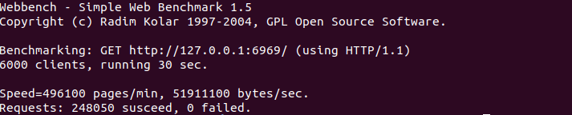
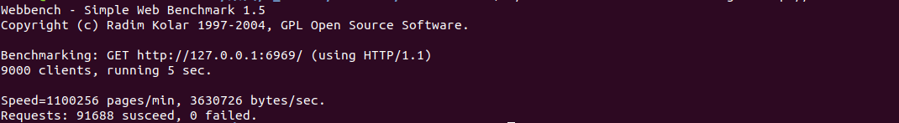
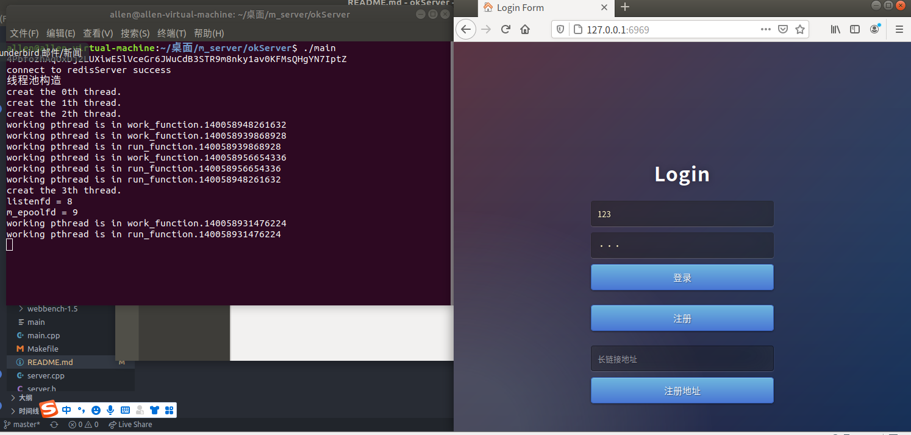
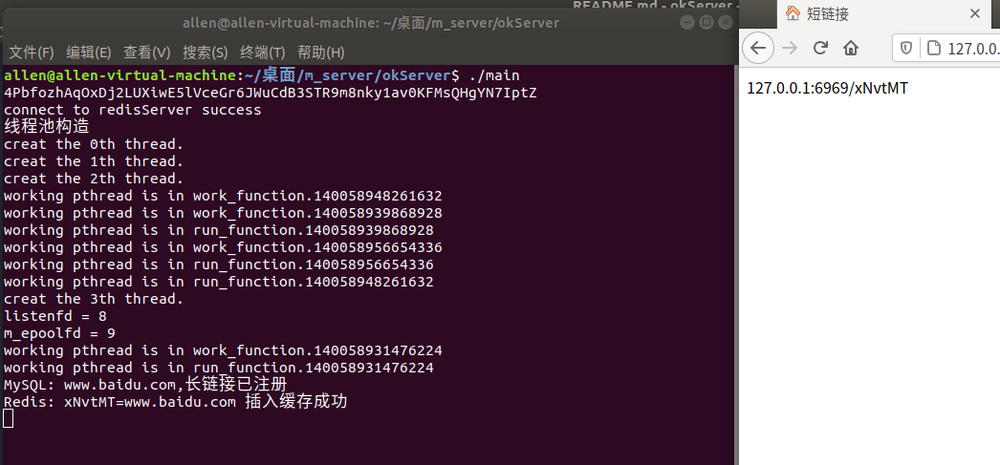
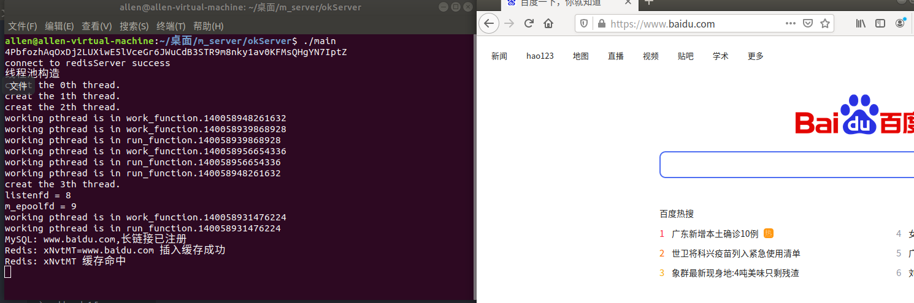
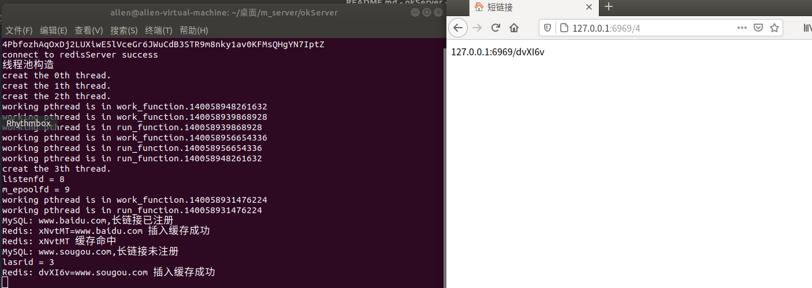
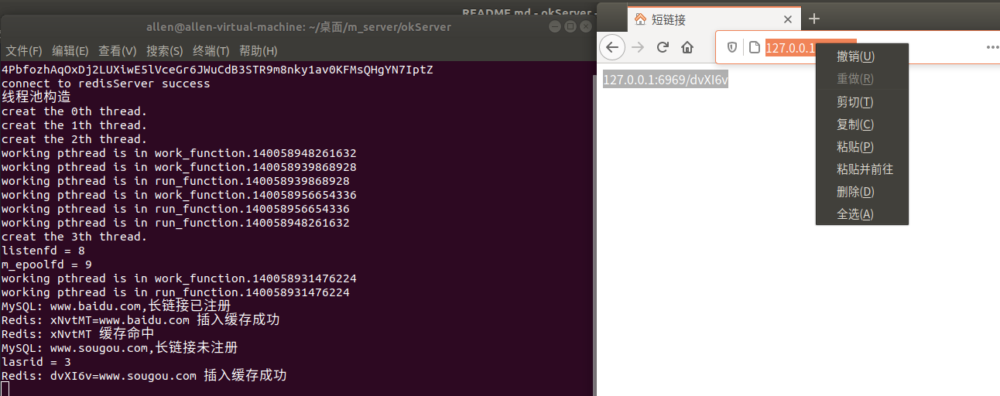
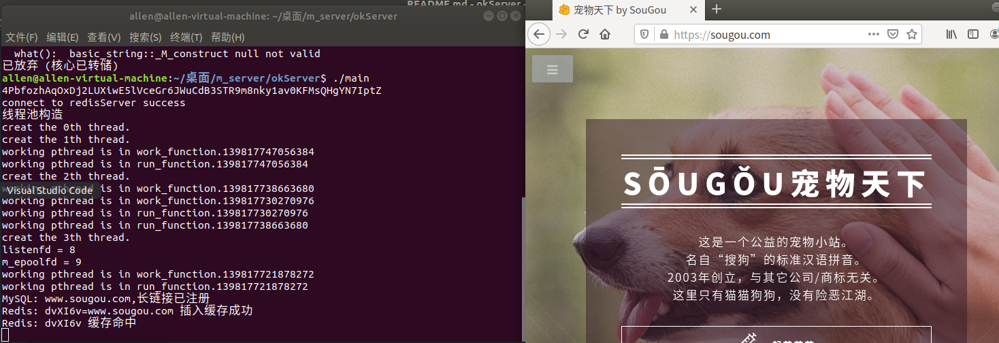
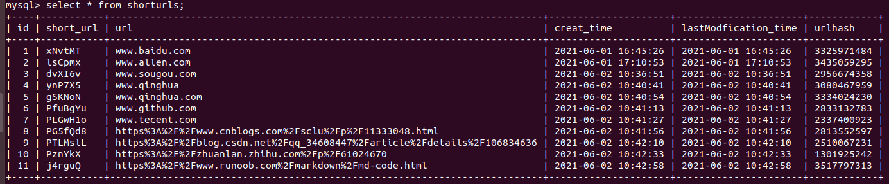

# okServer
  此项目是一个短链接服务器项目，是从之前做的一个高性能web服务器上延伸出来的。支持短链接注册

# 实现功能
  1. 创建线程池，单例模式获取对象
  2. 主从状态机，解析HTTPP报文
  3. 采用小根堆处理非活动连接
  4. 利用RAII机制创建了数据库（Mysql）连接池，减小数据库连接与关闭的开销
  5. 采用MySQL自增id作为发号器，转为62进制作为短地址
  6. 采用murmurhash对长链接哈希，验证长链接是否注册
  7. 采用Redis作为缓存区，避免MYsql的io读写瓶颈
# 环境要求
  1. Ubuntu 18.04
  2. MySQL 5.7.34
  3. Redis 4.0.9
  4. murmurhash3
# 目录树
```
.
├── hash                  默默哈希
│   ├── MurmurHash3.cpp
│   └── MurmurHash3.h
├── http_conn             http类
│   ├── http_conn.cpp
│   └── http_conn.h
├── locker
│   ├── locker.cpp
│   └── locker.h
├── main                
├── main.cpp             主函数
├── Makefile
├── redis                redis操作类
│   ├── myredis.cpp
│   └── myredis.h
├── server.cpp
├── server.h
├── server_root         资源文件
├── sql
│   ├── myDB.cpp
│   ├── myDB.h
│   ├── sqlpool.cpp
│   └── sqlpool.h
├── threadpool          线程池类
│   ├── threadpool.cpp
│   └── threadpool.h
├── timer               时间管理类
│   ├── timermanage.cpp
│   └── timermanage.h
└── webbench-1.5        压测软件

```
# 项目配置
1. Mysql建表
```SQL
// 建立myserver库
create database myserver;

// 创建user表
USE myserver;
CREATE TABLE shorturls(
    id int(11) NOT NULL,
    short_url varchar(255) not null,
    url varchar(255) not null,
    creat_time datetime not null,
    lastModfication_time datetime not null,
    urlhash bigint(20) not null,
    PRIMARY KEY (`id`),
) ENGINE=InnoDB DEFAULT CHARSET=utf8;

// 添加唯一索引
ALTER TABLE shorturls ADD UNIQUE (urlhash);
  ```
2. 安装redis

安装redis

```sudo apt-get install redis-server```

安装hiredis
```
1.git clone https://github.com/redis/hiredis.git

2.cd hiredis

3.make

4.make install

5.sudo ldconfig (更新动态库配置文件)
```
3. 运行

```
make

./main
```
# 效果展示

### 压测结果
此压测结果只是单纯web服务器的压测结果




### 运行图












### mysql

